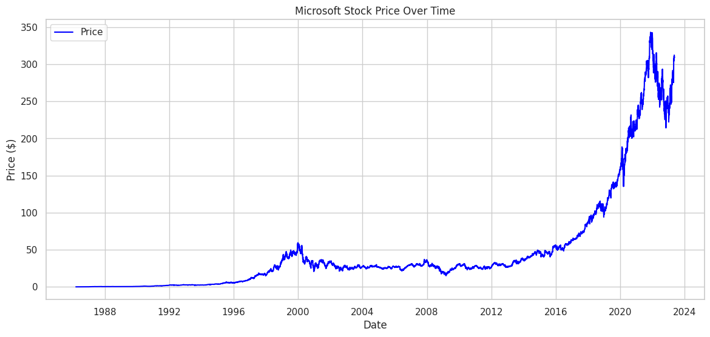
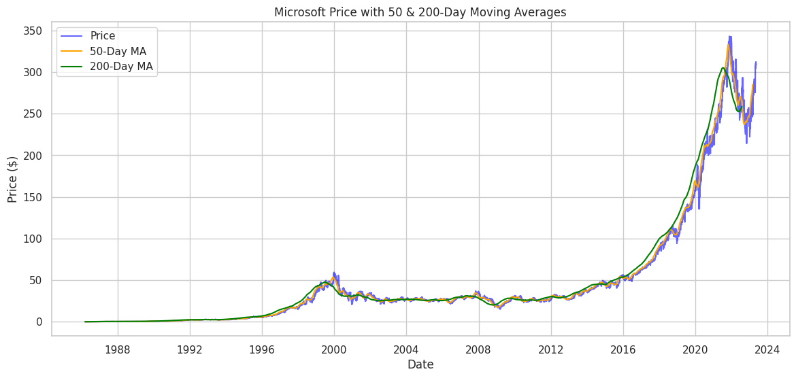
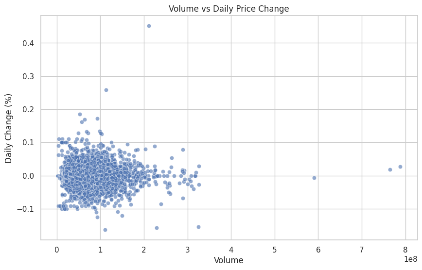
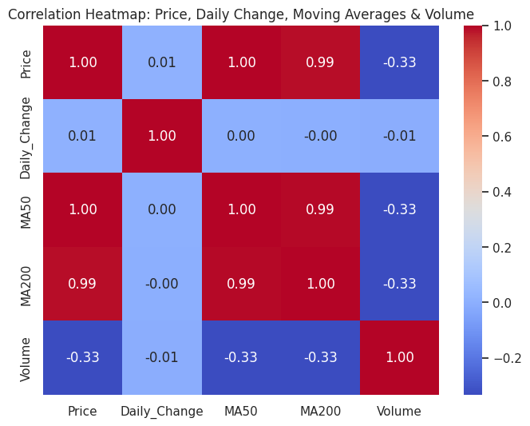

## Author

Daya  
[GitHub](https://github.com/dayalekshmi219218-glitch) | [LinkedIn](https://www.linkedin.com/in/daya-kumar27/)
# Microsoft Stock Analysis (MSFT)

A comprehensive analysis of Microsoft (MSFT) stock price history from the late 1980s to 2023, including visualizations, moving averages, daily changes, and correlations. This project demonstrates time series analysis, exploratory data analysis (EDA), and financial insights using Python (pandas, matplotlib, seaborn).

---

## Dataset

- Source: Historical Microsoft stock price data (CSV)
- Columns:
  - `Date` – Trading date
  - `Price` – Closing price
  - `Open`, `High`, `Low` – Price metrics
  - `Volume` – Trading volume

---

## Data Cleaning & Preparation

- Dropped duplicates and missing values
- Standardized column names
- Converted numeric columns to float/int
- Calculated additional features:
  - Daily % Change (`Daily_Change`)
  - 50-Day and 200-Day Moving Averages (`MA50`, `MA200`)

---

## Visualizations & Insights

### 1. Microsoft Stock Price Over Time
- Shows historical price trend from 1986 to 2023
- Key observations:
  - Long-term growth with early low prices
  - Dot-com bubble spike (~1998–2000) and decline
  - Stagnation period (~2002–2012)
  - Rapid growth post-2016, reaching around $350

### 2. Price with 50 & 200-Day Moving Averages
- Moving averages smooth price trends for technical analysis
- Insights:
  - Bullish trend post-2016 (Price > MA50 > MA200)
  - Golden Cross before major price ascent
  - Death Crosses indicate potential corrections

### 3. Volume vs Daily Price Change (Scatter Plot)
- Most days: low volume, small price changes
- High-volume days often have minimal price movement
- Outliers highlight significant trading events

### 4. Correlation Heatmap
- Strong Positive Correlations:
  - Price ↔ MA50, MA200 (0.99–1.00)
- Weak/No Correlations:
  - Daily Change ↔ Price, MA50, MA200, Volume (~0)
- Negative Correlation:
  - Volume ↔ Price/MA (~ -0.33) — high trading activity often during lower historical price levels

---

## Skills & Tools

- **Languages:** Python  
- **Libraries:** pandas, matplotlib, seaborn, numpy  
- **Skills demonstrated:** Data Cleaning, EDA, Time Series Analysis, Financial Analysis, Data Visualization, Correlation Analysis

---

## Example Visuals

